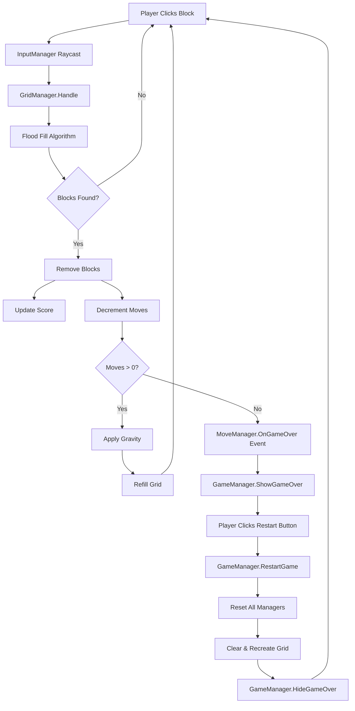

# Project-Blocky

A Unity-based grid puzzle game featuring block-matching mechanics with pseudo gravity physics. Players click on connected blocks of the same color to remove them, earning points while managing limited moves. Built with clean architecture using Zenject dependency injection and MVP pattern.

## 📋 Project Information

This project was developed as part of a Unity Game Developer technical assessment. For complete test specifications and requirements, please refer to the [Senior Unity Game Developer Test.pdf](./Senior%20Unity%20Game%20Developer%20Test.pdf) document.

## 🎮 Game Features

- **Grid-Based Puzzle Gameplay**: Interactive 6x5 grid system with flood-fill block detection
- **Block Matching Mechanics**: Click connected blocks of the same color to remove them
- **Gravity System**: Pseudo-gravity physics that makes blocks fall to fill empty spaces
- **Score & Move Tracking**: Earn points (10 per block) and manage limited moves (5 total)
- **Game Over & Restart**: Game over screen with restart functionality
- **Auto-Refill**: Automatically generates new random blocks to fill empty grid positions
- **Input Locking**: Prevents player interactions during animations and turn resolution

## 🏗️ Architecture Overview

This project follows **SOLID principles** and implements a clean, testable architecture using:

- **Zenject (Extenject)**: Dependency injection framework for loose coupling
- **MVP Pattern**: Model-View-Presenter separation for UI components
- **Event-Driven Design**: Managers communicate via C# events
- **Dependency Injection**: All dependencies injected via constructor/method injection

### Architecture Benefits

✅ **Testable**: All components can be unit tested in isolation  
✅ **Maintainable**: Clear separation of concerns  
✅ **Scalable**: Easy to add new features without breaking existing code  
✅ **No Editor Dependencies**: Button bindings and event wiring done in code  

## 📂 Project Structure

```
Project-Blocky/
├── Assets/
│   ├── Scripts/
│   │   ├── Installers/
│   │   │   └── GameInstaller.cs        # Zenject DI container configuration
│   │   ├── Managers/
│   │   │   ├── GameManager.cs          # Game state & restart orchestration
│   │   │   ├── GridManager.cs          # Grid logic, blocks, gravity
│   │   │   ├── ScoreManager.cs         # Score tracking & events
│   │   │   ├── MoveManager.cs          # Move counting & game over
│   │   │   └── InputManager.cs         # New Input System integration
│   │   ├── Presenters/
│   │   │   ├── ScorePresenter.cs       # Score UI presentation
│   │   │   └── MovePresenter.cs        # Moves UI & game over screen
│   │   ├── Utils/
│   │   │   ├── Constants.cs            # Game configuration constants
│   │   │   └── BlockColor.cs           # Block color enumeration
│   │   ├── Block.cs                    # Individual block component
│   │   ├── PlayerActions.cs            # Generated Input System actions
│   │   └── Scripts.asmdef              # Assembly definition
│   ├── Prefabs/                        # Block and UI prefabs
│   ├── Sprites/                        # Visual assets
│   ├── Scenes/                         # Game scenes
│   └── Settings/                       # URP and project settings
├── ProjectSettings/                    # Unity project configuration
└── Packages/                           # Unity packages and dependencies
```

## 🔧 Core Systems

### Dependency Injection (Zenject)

**GameInstaller.cs** - Configures the entire dependency graph:
```csharp
Container.Bind<ScoreManager>().AsSingle().NonLazy();
Container.Bind<MoveManager>().AsSingle().NonLazy();
Container.Bind<GridManager>().FromInstance(gridManager).AsSingle().NonLazy();
Container.Bind<GameManager>().FromInstance(gameManager).AsSingle().NonLazy();
Container.Bind<InputManager>().FromInstance(inputManager).AsSingle().NonLazy();
```

### Managers (Business Logic)

#### **GameManager** (MonoBehaviour)
- Orchestrates game state and restart flow
- Coordinates reinitialization of all managers
- **Manages game over UI** (shows/hides game over screen)
- **Binds restart button** programmatically in `Awake()`
- Subscribes to `MoveManager.OnGameOver` to show game over screen
- **Key Method**: `RestartGame()` - Resets all managers and hides game over screen

#### **GridManager**
- Creates and manages the 6x5 grid of blocks
- Handles block click events via flood-fill algorithm
- Implements pseudo-gravity (blocks fall to fill gaps)
- Manages turn resolution coroutine
- Auto-refills empty grid positions
- **Key Methods**: `Handle(Block)`, `RestartGrid()`, `ClearGrid()`

#### **ScoreManager**
- Tracks current score
- Provides `OnScoreChanged` event
- Calculates points: `blocks removed × 10`
- **Key Method**: `AddScore(int amount)`

#### **MoveManager**
- Tracks remaining moves (starts at 5)
- Triggers game over when moves reach 0
- Provides `OnMovesChanged` and `OnGameOver` events
- **Key Methods**: `UseMove()`, `Initialize()`

#### **InputManager**
- Integrates Unity's new Input System
- Detects block clicks via raycasts
- Delegates to GridManager for processing

### Presenters (UI Layer)

#### **ScorePresenter**
- Displays current score via TextMeshPro
- Subscribes to `ScoreManager.OnScoreChanged`
- Updates UI reactively when score changes

#### **MovePresenter**
- Displays remaining moves via TextMeshPro
- Subscribes to `MoveManager.OnMovesChanged`
- Updates UI reactively when moves change
- **Single responsibility**: Only handles move count display

### Game Flow




## 🛠️ Technologies Used

- **Unity 6.0 LTS**
- **C# 9.0+**
- **Zenject (Extenject)** - Dependency injection
- **Universal Render Pipeline (URP)**
- **Unity New Input System**
- **TextMesh Pro**

## 🚀 Getting Started

### Prerequisites
- Unity 6.0 LTS or later
- Visual Studio 2022 or Rider

### Setup
1. Clone the repository:
   ```bash
   git clone https://github.com/CesarJorahua/Project-Blocky.git
   ```
2. Open the project folder in Unity Hub
3. Unity will automatically import Zenject and other packages
4. Open the main scene from `Assets/Scenes/`
5. Press Play to start the game

## 🎯 How to Play

1. **Click any block** in the grid
2. All **connected blocks of the same color** will be removed
3. Blocks above **fall down** to fill empty spaces (gravity)
4. New blocks **spawn** to fill the grid
5. **Earn 10 points** per block removed
6. You have **5 moves total**
7. Game ends when moves reach 0
8. Click **Restart** to play again

## 📝 Configuration

All game parameters are in `Assets/Scripts/Utils/Constants.cs`:

```csharp
public const int ROWS = 6;           // Grid height
public const int COLUMNS = 5;        // Grid width
public const float CELL_WIDTH = 1.28f;
public const float CELL_HEIGHT = 1.28f;
public const int POINT_MULTIPLIER = 10;
public const float AWAIT_RESOLUTION = 1f;  // Turn resolution delay
```

Initial moves are set in `MoveManager.Initialize()` (default: 5).

## 🧪 Testing

The architecture enables easy unit testing:
- **Managers**: Mock dependencies via Zenject or manual injection
- **Presenters**: Test event subscriptions and UI updates
- **Grid Logic**: Test flood-fill algorithm in isolation

## 🎨 Code Quality

- **SOLID Principles**: Single Responsibility, Dependency Inversion
- **Clean Code**: Comprehensive XML documentation
- **No Magic Strings**: Constants used throughout
- **Event-Driven**: Loose coupling between systems
- **Memory Safe**: Proper event subscription cleanup in `OnDisable`/`OnDestroy`

## 📄 License

Please refer to project documentation for licensing information.

## 👤 Developer

**Cesar Mory Jorahua**  
Developed as part of a Unity Game Developer technical assessment.

---

*Built with ❤️4🎮 using Unity, C#, and Zenject*